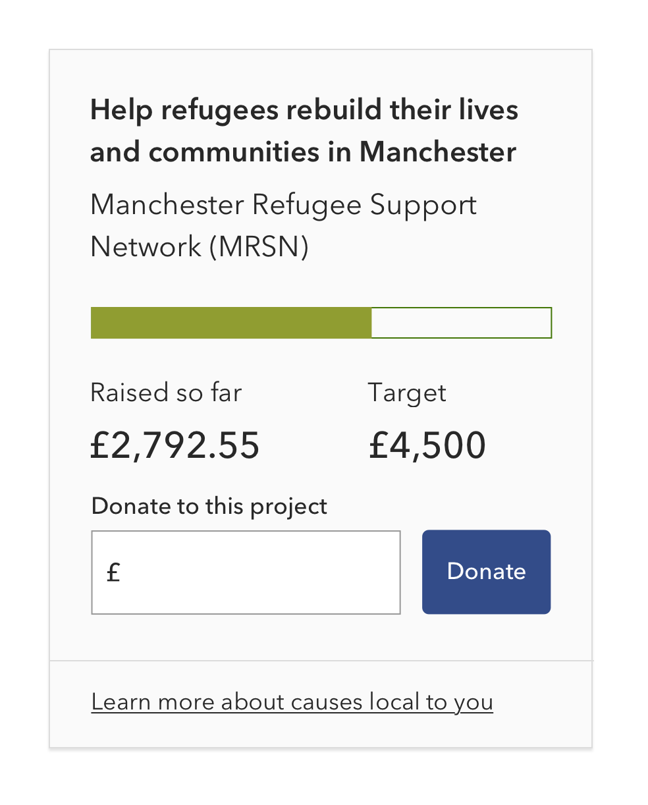

# Front-end dev test

We would like you to build the charity donation component from the image ([charity-donation-component.png](charity-donation-component.png?raw=true)) contained in this package. There is no right or wrong way to go about it. We want to see your approach to HTML, CSS, and JavaScript. The design is a bit static, so feel free to make it come to life a little. Have fun with it!

We have also created [a small API](https://github.com/coopdigital/coop-hiring-test-mock-api) which returns some mock data for the raised and target amounts. If you can, make use of it to display dynamic data. The API endpoint itself is at <https://coop-mock-test-api.herokuapp.com>.

## Deliverable

We would like to see the component you built in action, so sending us the build folder would be great. However, we are equally interested in your approach to building the component, so please also include all your source files.

Even better: create a repository to work on your component, and give us access to it!

## These might help

We have built some tools that help our developers build Co-op branded content quickly, and you are free to use them as much or as little as you want:

- The [**Co-op Front-end Toolkit**](https://github.com/coopdigital/coop-frontend-toolkit) contains a set of base styles and assets that are used across Co-op Digital. You should make use of those in building your component.
- The [**Co-op Prototyping Kit**](https://github.com/coopdigital/coop-prototyping-kit) is a small framework that makes it simple to build and deploy small branded prototypes. It uses the Co-op Front-end Toolkit above, and may well prove a good way of kickstarting your work on the component.

### Good luck, and have fun coding!
